# Dog Recognition Based On Convolutional Neural Networks And Transfer Learning

## High-Level Overview

* As the last project in UDACITY Data Science, the goal of this project is to classify dog images based on their breed,
* Solving the issue of dog breed classification may also help some dog houses determine the type of dog
* If you are learning about convolutional neural networks or transfer learning, I believe this blog will be of great help to you.
* If you are interested in learning about artificial intelligence, reading this blog will be a great choice for you

## Description of Input Data

* Data is the core of a project, and the quality of the data will determine the quality of the model
* The dataset for this project consists of over 8320 images, provided by UDACITY. The dataset is divided into training set data of 6680 images, validation set of 835 images, and test set of 836 images. The dataset is very suitable for use and meets the requirement of training set: validation set: test set=8:1:1.
* This project also has some model data, including pre trained model data for VGG-16 and pre trained model data for Resnet50, which will become the main data for this project

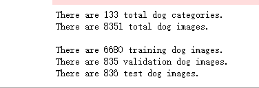


## Strategy For Solving The Problem

* To identify and classify dog breeds, this article will use three models to solve this problem. The models will be introduced later, and now we will introduce convolutional neural networks

### Convolutional Neural Network

* CNN is a deep structured feedforward neural network that includes convolutional operations and is widely used in fields such as image recognition and natural language processing

* CNN generally includes 5 network structures, namely

  1. Input layer
     * The original input of a convolutional network can be either the original or processed pixel matrix

  2. Convolutional layer
     * It is the core layer of convolutional neural networks, with parameter sharing, local connections, and the use of translation invariance to extract local features from global features

  3. active layer
     * Nonlinear mapping of the output results of convolutional layers

  4. Pooling layer
     * Effectively reducing the number of parameters required for subsequent network layers

  5. Fully connected layer
     * Flatten multi-dimensional features into two-dimensional features, usually with low dimensional features corresponding to the learning objectives of the task

* As this project revolves around convolutional neural network models, the above is an introduction to convolutional neural network models

## Discussion Of The Expected Solution

* This project adopts the construction, training, and evaluation of three models to compare them, and finally uses the best model among the three models as the final model of this project to identify and classify dog breeds
* Use the OpenCV module to process images, use the Kreas module to build various convolutional neural networks, and use the sklearn and numpy modules for model evaluation to obtain the final model results. Finally, upload images for dog breed recognition

## Metrics With Justification

* The model evaluation method used in this project is to compare the predicted types with the actual types, in order to obtain accuracy and judge the quality of the model.

## Data Preprocessing

* This project only performed one data processing, which is to compress the image. The method is to scale the image by 255 pixels per pixel and import it as shown in the following figure

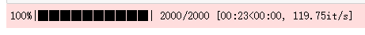

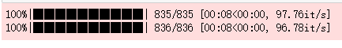


## Modeling

* This project uses a total of three models introduced above to solve recognition problems

### Model 1: A simple convolutional neural network built by oneself

* The self built convolutional neural network consists of three convolutional layers, three pooling layers, and an unfolding layer, as shown in the following figure

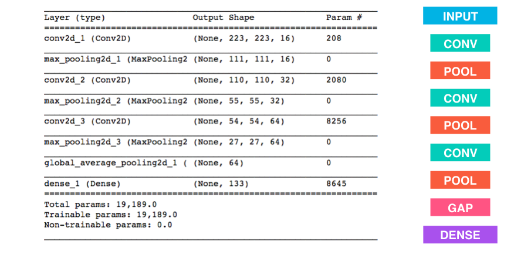

* Build your own convolutional neural network model using the Keras module, with the following code:

* ```python
  from keras.layers import Conv2D, MaxPooling2D, GlobalAveragePooling2D
  from keras.layers import Dropout, Flatten, Dense
  from keras.models import Sequential
  
  model = Sequential()
  
  ### TODO: Define your architecture.
  model.add(Conv2D(filters=16, kernel_size=2, padding='same', activation='relu', 
                          input_shape=(224,224,3)))
  model.add(MaxPooling2D(pool_size=2))
  
  model.add(Conv2D(filters=32, kernel_size=2, padding='same', activation='relu'))
  model.add(MaxPooling2D(pool_size=2))
  
  model.add(Conv2D(filters=64, kernel_size=2, padding='same', activation='relu'))
  model.add(MaxPooling2D(pool_size=2))
            
  model.add(Flatten())
  model.add(Dense(133, activation='softmax'))
  
  model.summary()
  ```

  

### Model 2: Convolutional Neural Network for VGG-16

* Train and predict data using the pre trained model VGG-16 convolutional neural network, with the network structure shown in the following figure

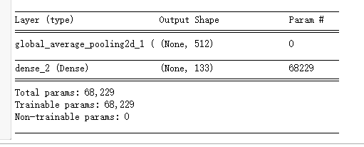

### Model 3: Resnet-50 Convolutional Neural Network

* Train and predict data using the pre trained Resnet-50 convolutional neural network model, with the network structure shown in the following figure:

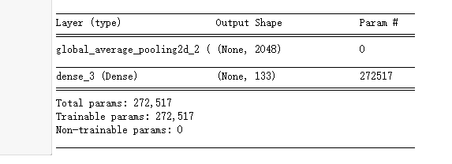

## Hyperparameter Tuning

* This project did not use hyperparameter adjustment techniques, but directly used the parameters in the fit method of the model and adjusted epochs and batch_ These two parameters, size, are used for model control. Due to time and equipment reasons, I have adopted epochs of 30 and batch_ Train the model with a size of 4


## Modeling Training

* The above three models are trained separately, and the fit method is used to train the models. The training process of the three models is shown in the following figure:

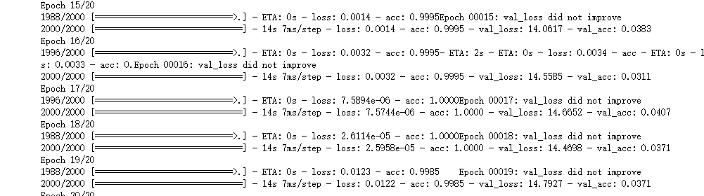

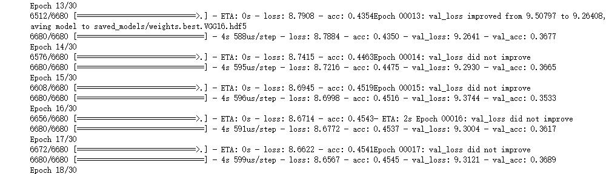

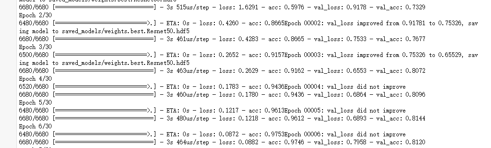


## Results

* The effectiveness of the three models is measured by the accuracy mentioned above. The higher the accuracy, the better the model's performance. The accuracy of the three models is shown in the following figure
* Build a simple convolutional neural network on your own

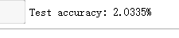

* VGG-16 Convolutional Neural Network

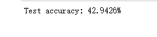

* Resnet-50 Convolutional Neural Network

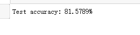

* From this result, it can be seen that the Resnet-50 convolutional neural network has a good performance and can achieve the results of this project
* This project conducts model testing on the Resnet-50 trained model
* Two images will be input for the model to recognize, and the results are shown in the following figure

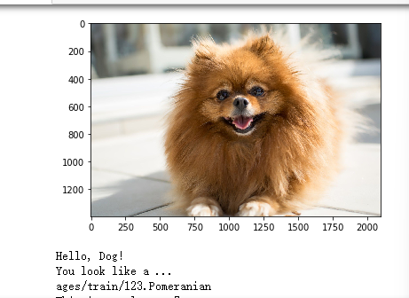


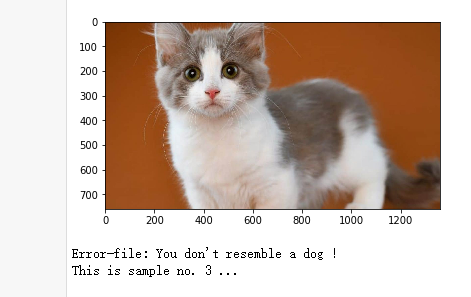

* From the recognition results, it can be seen that the model can basically achieve its functions

## Conclusion

* This project used a total of three models to classify dog breeds. It was found that the convolutional neural network built by oneself was not effective due to its simplicity. Using transfer learning pre training models for training resulted in much better results. Finally, this project used the Resnet-50 model to predict dog breeds

## Improvements

* Due to time and equipment issues, this project is unable to train and compare other models. You can try other pre trained models, and if possible, you can also build a more complex convolutional neural network model yourself to try
* At the same time, the dataset can also be expanded to better process the data and obtain better models

## Acknowledgment

* Thank you UDACITY for providing me with the dataset and ideas. Thank you very much
* This project can be used for learning, not for trading. Everyone can also learn from any field or method they are interested in, in order to become stronger