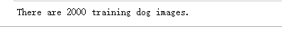

# Dog Recognition Based On Convolutional Neural Networks And Transfer Learning

## Introduction

This project aims to use convolutional neural networks and transfer learning to solve the problem of puppy recognition. Next, the following aspects will be explained:

1. [Project Overview](#Project Overview)
2. [Environmental Introduction](#Environmental Introduction)
3. [Data Download And Processing](#Data Download And Processing)
4. [Building a Convolutional Neural Network Model](#Building a Convolutional Neural Network Model)
5. [Model Training](#Model Training)
6. [Model Evaluation](#Model Evaluation)
7. [Transfer Learning](#Transfer Learning)
8. [Model Testing](#Model Testing)
9. [Summarize](#Summarize)

## 1.Project Overview

### 1.1BACKGROUND

This project is a task from the UDACITY Data Scientist Capstone project - dog recognition using convolutional neural networks. There are many types of puppies, and this project is used to identify whether the image is a puppy. If it is recognized as a dog, it is written as a dog. If it is recognized as a human, it will determine which breed of dog the person is imagining. If it is recognized as neither a human nor a dog, it will return No. Due to the high cost of training neural networks, we adopt transfer learning to reduce costs.

### 1.2Project data source

The data is sourced from all the images provided by Udacity, and the images have been separated into training, validation, and testing sets for our convenience. We would like to thank Udacity for providing the dataset

## 2.Environmental Introduction

Firstly, the environment is Anaconda and the following software packages are installed:

* opencv
* keras
* jupyter
* scikit-learn
* pandas
* matplotlib

The above are the main software packages, and the specific ones will not be introduced here

## 3.Data Download And Processing

* The data comes from Udacity, we download the data and import it
* The quantity of discovered data is shown in the following figure

* However, during subsequent data import, it was found that due to time and device limitations, the train could only be changed from 6680 images to 2000 images for ease of use, as shown in the following figure

* Finally, compress the image for future use, as shown in the following image

* After compression is completed and imported, data processing ends

## 4.Building a Convolutional Neural Network Model

* Next, we will start building a relatively simple convolutional neural network to see the recognition effect. The content of the network model is shown in the following figure

* When we use the Keras module and some methods to construct something similar to the one shown in the above figure, we can start model training

## 5.Model Training

* When our model is ready, let's set some simple parameters, such as epochs and batch_ After waiting for the size, you can use the fit method for model training. The training process is shown in the following figure

## 6.Model Evaluation

* After training the model, it is important to take a look at what kind of model we are training. Accuracy can be used to determine the results, as shown in the following figure

* From the above figure, it can be seen that the performance of the simple convolutional neural network built by oneself is not very good, or it can be said to be very poor. The training of complex convolutional neural networks requires a lot of time and excellent equipment, which we cannot achieve. However, the recognition function also needs to be implemented. Therefore, in the future, we will use transfer learning methods to help us complete this project

## 7.Transfer Learning

* Transfer learning is actually the process of pre training a model that has been trained by others. If the purpose of training a model by others is similar to one's own, then the pre trained model trained by others can also be used. You can also add your own convolutional neural network after someone else's pre trained model.

### Using pre trained models to build convolutional neural networks

#### 1.Building Convolutional Neural Networks Using VGG-16 and Training and Evaluation

* The structure of building the model is shown in the following figure

* Train the model built using VGG-16, as shown in the following figure

* Evaluate the VGG-16 model trained by oneself and find that the performance is much better than the model without pre training, as shown in the following figure

* But the effect is still not good enough, with an accuracy of only about 0.43, so we will use a more complex pre training model

#### 2.Building Convolutional Neural Networks Using Resnet50 and Training and Evaluation

* The structure of the convolutional neural network model using Resnet50 is shown in the following figure

* Train the Resnet50 model using the same basic parameters, as shown in the following figure

* Evaluate the trained Resnet50 model as shown in the following figure

* It can be seen that there is still a significant difference in performance compared to VGG-16 and models without pre trained models. Finally, we used the Resnet50 model for model training to see if the test results met our expectations

## 8.Model Testing

* Let's write a test function to return what we want, whether the recognized object is a dog, and if it is a human, what kind of dog it is like, or if it is neither a human nor a dog, as shown in the following figure

* From the above figure, it can be inferred that the model can basically recognize images of dogs and provide a judgment

## 9.Summarize

* Firstly, we can also build our own convolutional neural network model to solve practical problems, but due to time and equipment constraints, the results of our own model training generally do not meet our expectations
* So we use transfer learning methods to solve such problems, and the results are still good
* Finally, for me, there is a lot of knowledge about big data, and it can solve many problems in life. Let's learn about big data/artificial intelligence together